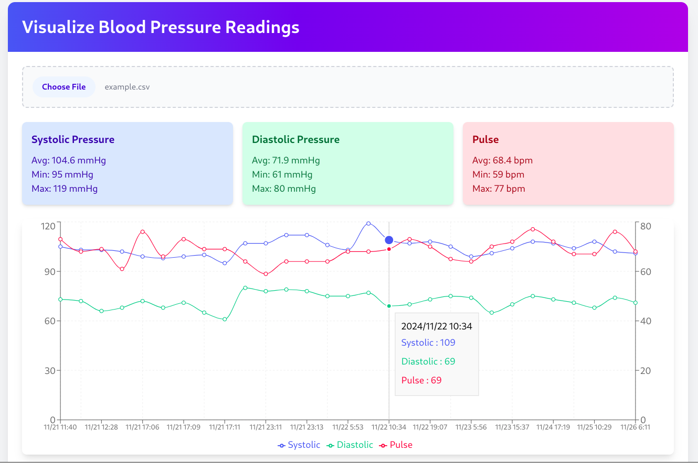

# Visualize Blood Pressure Readings

This **React app** helps to **visualize "Omron Blood Pressure Readings" Export Data** in an easy-to-understand format. 

The app transforms raw data from your Omron device into **interactive graphs and summaries** to help you monitor and analyze your blood pressure trends.

Online demo: [https://vpnry.github.io/visualize-blood-pressure/](https://vpnry.github.io/visualize-blood-pressure/)




---

## Privacy & Disclaimer

- **Privacy First**: Your data remains completely private and never leaves your browser.

- **Offline Access**: You can [download this HTML app](https://github.com/vpnry/visualize-blood-pressure/archive/refs/heads/master.zip) and run it offline.
  
- **Android App**: You can also **download the Android APK** from the [Releases page](https://github.com/vpnry/visualize-blood-pressure/releases).  

- This app was created primarily for **personal testing purposes**. While efforts have been made to ensure its functionality, **use it at your own risk**. The creator assumes no responsibility for any errors or misinterpretations of the data. Always consult a healthcare professional for medical advice.  

---


## How to Export CSV from OMRON App

- Open OMRON Connect app
- Select your blood pressure measurement history
- Look for **Export** measurement data or **Share** option
- Choose CSV file format
- Once exported, upload the CSV file into this app to visualize your data.
- Your data remains completely private and never leaves your browser.

## Devs
1. **Clone this Repository**:
   ```bash
   git clone https://github.com/vpnry/visualize-blood-pressure.git
   ```
2. **Navigate to the Project Directory**:
   ```bash
   cd visualize-blood-pressure

   ```
3. **Install Dependencies**:
   ```bash
   npm install
   npx tailwindcss init -p

   ```
4. **Start the App**:
   ```bash
   npm start

   ```

## Attributions

- Code is generated with [Claude](https://claude.ai/chat) 

- Icon is generated with [FLUX.1-dev](https://huggingface.co/spaces/black-forest-labs/FLUX.1-dev) & [https://icon.kitchen](https://icon.kitchen/)